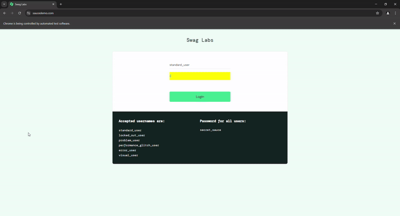

## 🌟 Introduction

Welcome to the **Selenium Test Automation Framework** for **SauceDemo**! This framework automates functional and UI testing for the SauceDemo website, an e-commerce platform used for test automation practice. The goal is to ensure high-quality and bug-free interactions for end users.

🔧 **Built With:**
- **Selenium** 🐍 - For automating browser actions
- **Python** 🐍 - For scripting and automation logic
- **Pytest** 🐍 - For test execution and reporting
- **Allure** 🌟 - For generating and serving interactive test reports
- **Page Object Model** (POM) 📂 - For scalable and maintainable test scripts

This framework performs automated tests on user workflows such as logging in, adding/removing items to the cart, sorting products, and validating product details.

---


## 🚀 Features

- **Login Automation**: Test successful and unsuccessful login scenarios.
- **Cart Management**: Add/remove products from the shopping cart.
- **Product Sorting**: Sort products by price, name, and other parameters.
- **Error Message Validation**: Ensure proper error messages are shown for invalid login attempts.

## 🌟 Allure Reports

This project uses **Allure** to generate interactive and detailed test reports. After running the tests, you can view the results in a visual format by running the following command:

```bash
allure serve allure-results
```

---

## 🔍 Summary

This project showcases my ability to build scalable and maintainable test automation frameworks using Selenium and Python. It highlights my skills in automating user workflows, ensuring software quality, and working with modern testing frameworks.

Feel free to explore the repository, and don't hesitate to reach out if you'd like to discuss any aspects of this project or the automation practices used here. 
---
